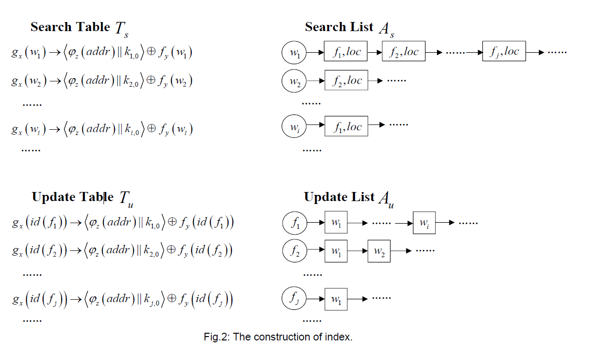
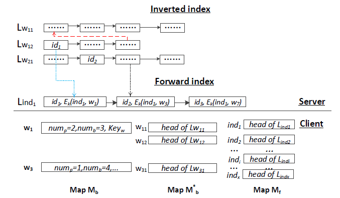

# 实验方案

## Dynamic Multi-phrase Ranked Search over Encrypted Data with Symmetric Searchable Encryption

+ 每个关键字对应一系列包含该关键字的文件，Dictionary keywordCollection&lt;keyword,file&lt;list &gt;&gt;
  
+ 查询过程先将关键字生成的token,p=(w1,w2),wi={gx(wi),fy(wi)},其中gx(wi)用于在search table中寻找关键字对应的条目，然后通过计算𝑇s[𝑔x (𝑤1)] ⊕ 𝑓y (𝑤1),通过计算结果可以获取到该关键字在keywordCollection中的位置

+ 服务端搜索所有的keywordCollection中的列表，返回同时包含多个关键字的文件

## Searchable encryption with Secure and efficient Updates

+ 先从inverted index中查询关键字是否是最近的搜寻过的，如果是则将关键字对应的文件列表进行返回

+ 如果inverted index中没有相关关键字，则在所有的文件-关键字对中进行遍历搜索文件，返回合适的结果

## Searchable Symmetric Encryption with Forward Search Privacy

